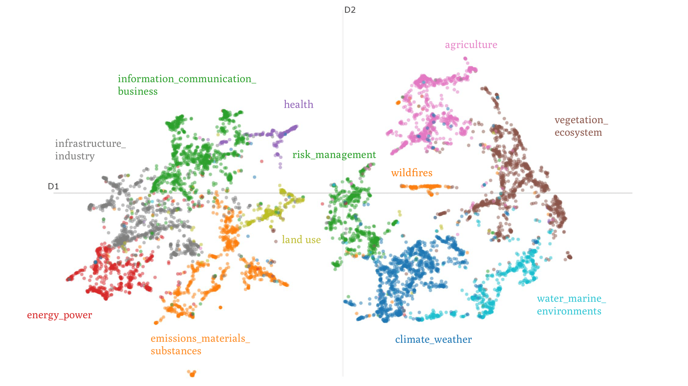

# [Meta-study:] Mapping the Landscape of AI, ML, and DL in Climate Change Research: Impacts and Applications
This is a project that aims to assess the impact and roles of AI, ML, and DL in climate change research. The assessment will be done by crawling the Elsevier articles database to gather relevant articles, and then apply clustering and other text analysis techniques on the compiled data.

The goal is to provide a brief, high-level snapshot of how AI, ML, and DL intersect with climate change. We'd like to shed light on the dominant topics and views within the scientific community. We're mainly interested in understanding if the mentioned disciplines are considered valuable tools in tackling climate change thorughout or, conversely, if and in what way they could be contributing to the problem.



Image source: https://hub.jhu.edu/2023/03/07/artificial-intelligence-combat-climate-change/

## Code structure
The `crawling` folder contains all scripts to crawl the Scopus database for articles and consequently store those in an SQL database:<br />

`main.py` handles and runs all scripts <br />
`BaseScopusCrawler` handles most of the basic Scopus API interaction <br />
`ScopusCrawlerDB` saves the data into an SQLAlchemy database <br />

Due to local computing constraints, the analysis (Topic Modelling, Clustering, Text analysis) was run in Google Colab. The notebook can be found in the `analysis` folder.

## Some useful commands
### SQL shorts
```
psql -U postgres -h localhost -p 5432 -f C:\Users\jch\ai_cc\crawling\db_style.sql
```

### Updating environment
```
conda env update --prefix ./myenv --file environment.yml --prune
```

